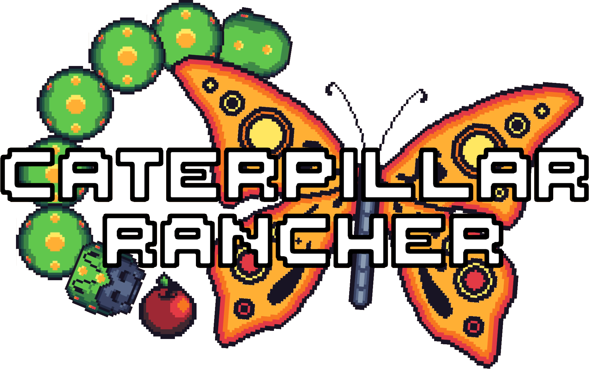
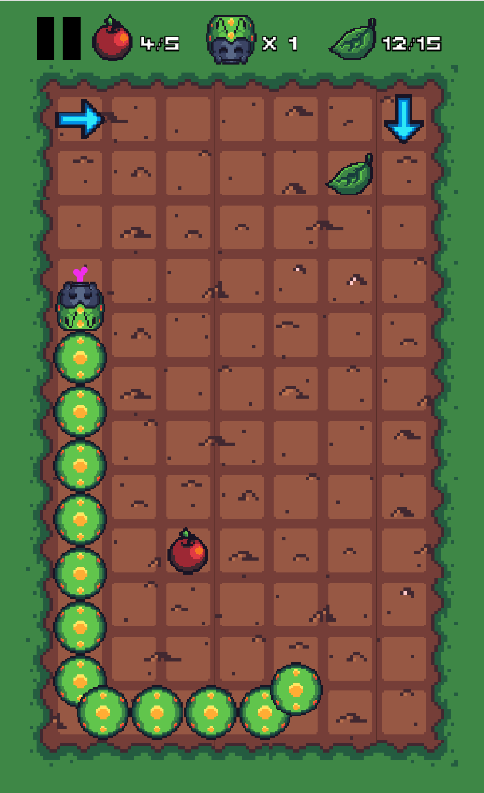

# Caterpillar Rancher

Caterpillar Rancher is a casual snake-like mobile game for Android. I made this over the course of six months or so as a hobby project for learning game dev. If you're just getting into Unity, I hope you find this interesting. If you want to contribute or start a discussion, even better!

## :art:

## Gameplay
You guide your caterpillar around a 7X12 grid by placing arrows in its path. Press the square one which you want to place an arrow, and then swipe in the direction you want your bug to go when it lands on the arrow. You can place up to two arrows at once.

The goal is to collect enough leaves to turn into a butterfly and win the level. Each level gets harder as your caterpillar gets faster, and the number of leaves needed to transform increases.

If your caterpillar crashes into itself, or into a wall, you lose a life. Lose all your lives and it's game over. You can get extra lives by collecting apples which spawn ocassionally. Apples disappear quickly, so if you see one, try to pick it up as fast as possible!

## Project Architecture
### Scenes
*PersistentScene* is loaded at all times and contains the main camera, some UI elements and in-game menus, and singleton `xxxManager` classes responsible for state management.

*MainGameScene* contains the play area and logic for controlling the caterpillar. The play area is a 7x12 Tilemap Grid.

### Caterpillar Movement
See: `Caterpillar.cs`.
The head of the caterpillar dictates movement. The head continuously moves towards the tile in front of it. When it reaches the tile:
- The head's target becomes the next tile in front of it
- For each segment of the caterpillar's body, its target is updated to the tile in the direction of the segment in front of it.

The head's direction changes when it collides with an Arrow placed by the player.

### Google Play Game Services
[Play Game Plugin for Unity](https://github.com/playgameservices/play-games-plugin-for-unity) is used to provide Play Games login and high score leaderboards.

IMPORTANT: As of writing, this plugin is incompatible with R8 code minification. You must use Proguard instead, and possibly restrict to Android API Version 32, depending on your Java installation.

## Want to contribute, or have a question or comment?
The biggest lesson from this project is that game dev is HARD. If you have thoughts on how I can make this game better, I'd love to hear from you.

If you're new to game dev and want to tinker with a full game before starting one of your own from scratch, I welcome any and all contributions.

If you have an issue, idea, question, or anything at all, please create an Issue on this pull request, or start a discussion on the [game's subreddit here](https://www.reddit.com/r/caterpillarrancher/).

## Credits

- [Music on Unity Asset Store](https://assetstore.unity.com/packages/audio/music/free-music-for-puzzle-games-152395)
- [SFX on Unity Asset Store](https://assetstore.unity.com/packages/audio/sound-fx/cartoon-games-sound-effects-211274)
- [Art by the Talented pabsoher on Fiverr](https://www.fiverr.com/pabsoher?source=gig_cards&referrer_gig_slug=make-pixel-art-tilesets-for-your-videogame&ref_ctx_id=abd76c44119c534da223969f9c24adfd&imp_id=c36620f7-92d0-48dc-936f-430dae5f72f1)
- [Udemy course I started learning gamdev with](https://www.udemy.com/course/unity-2d-game-developer-course-farming-rpg/)